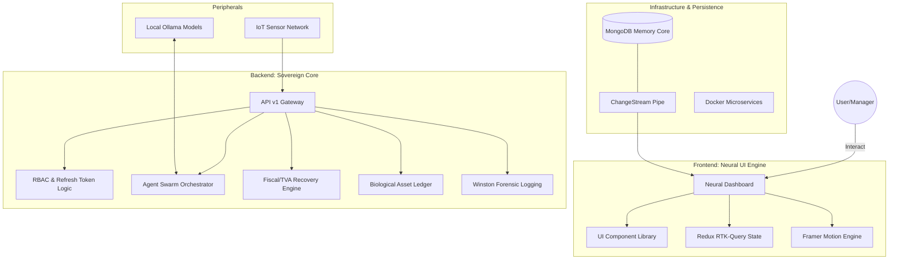

# 🌾 Golden Farm: The Sovereign Digital Twin Platform

[](https://github.com/semlalie8/GoldenFarm)
[]()
[]()

**Golden Farm** is a high-fidelity, enterprise-grade operating system designed to manage modern agricultural ecosystems. It transcends traditional ERPs by integrating **Autonomic AI Agents**, **Real-time IoT Telemetry**, and **Sovereign Fiscal Logic** into a unified Digital Twin.

---

## 🌌 1. The Architectural Mind Map



---

## 🧠 2. Core Functionality: What Golden Farm Does

### 🏦 Sovereign Finance (TVA 2.0)
Unlike generic accounting software, Golden Farm features a **hard-coded Fiscal Engine** tuned to the 2026 Moroccan Tax Reform.
*   **Automated VAT Recovery:** Real-time segregation of 20% (Standard) vs 10% (Agricultural) TVA.
*   **Fiscal Simulation:** Predict "Cash-in-Bank" after tax obligations before committing transactions.
*   **Compliance:** Automated generation of Bilan and CPC-ready datasets.

### 🐄 The Biological Ledger (IAS 41)
Tracks livestock not just as static inventory, but as **Appreciating Biological Assets**.
*   **Life-Cycle Tracking:** Detailed logs for Vaccination, Health Events, and Feed Conversion Ratios.
*   **Fair-Value Accounting:** Dynamic valuation based on live market prices and asset maturity.

### 👥 Enterprise HR (Code du Travail)
A complete labor management suite compliant with local legal standards.
*   **Neural Payroll:** Automated calculation of **CNSS (Capped)**, **AMO (Uncapped)**, and tiered **Income Tax (IR)**.
*   **Attendance Bridging:** Biometric-ready logs that auto-calculate overtime at 125% and 150%.

### 🤖 Autonomic Agent Swarm
The platform is inhabited by specialized AI agents that run on the server:
*   **Compliance Officer:** Scans transactions for AML (Anti-Money Laundering) breaches.
*   **Environmental Risk Agent:** Monitors IoT streams to trigger proactive irrigation or livestock cooling.
*   **Inventory Optimizer:** Analyzes stock burn-rates to suggest restocking before outages occur.

---

## 🛠 3. The Technology Stack

| Layer | Technology | Purpose |
| :--- | :--- | :--- |
| **Frontend** | React 18, Vite | High-performance user interface |
| **Styling** | Vanilla CSS + Framer Motion | Premium "Neural" aesthetic and animations |
| **State** | Redux Toolkit & RTK-Query | Global data synchronization & caching |
| **Backend** | Node.js, Express | Modular service-oriented architecture |
| **Database** | MongoDB | Document-based "Memory Core" for JSON flexibility |
| **Real-time** | Socket.io | Zero-latency notification & IoT syncing |
| **Security** | JWT, Bcrypt, RBAC | Multi-user fortress architecture |
| **Containers**| Docker, Docker-compose | Instant multi-service orchestration |
| **Logging** | Winston | Forensic, PII-scrubbed historical audit trails |

---

## 🏗 4. Directory Structure: The Anatomy

```bash
GoldenFarm/
├── client/                 # Frontend React Application
│   ├── src/
│   │   ├── components/ui/  # Extracted Design System (Buttons, Cards, Badges)
│   │   ├── context/        # Theme & Global State Contexts
│   │   ├── pages/          # 50+ Specialized Dashboard Views
│   │   └── store/          # Redux Slices (Finance, CRM, Inventory)
├── server/                 # Backend Node.js Engine
│   ├── agents/             # Autonomous Decision Logic
│   ├── controllers/        # executive Logic per Module
│   ├── models/             # Schema definitions for the Digital Twin
│   ├── routes/             # API v1 Versioned Endpoints
│   └── services/           # The "Heavy Lifters" (Payroll, TVA, Backups)
├── scripts/                # DevSecOps Automation (Backups, Key Rotation)
├── docker-compose.yml      # The Platform Orchestrator
└── IMPLEMENTATION_PLAN.md  # The 2026 Engineering Blueprint
```

---

## 🚀 5. Getting Started (Production Deployment)

### Prerequisites
- Docker & Docker Desktop
- Node.js v18+

### Step 1: Ignite the Microservices
Spin up the Database, Backend, and Frontend containers simultaneously:
```bash
npm run docker:up
```

### Step 2: Secure the Perimeter
Run the interactive key rotation script to set your production credentials (Google OAuth, Secrets):
```bash
npm run secure:rotate
```

### Step 3: Verify Intelligence
Access the Neural Dashboard at `http://localhost:5173` and check the **Sovereign Audit** page to ensure all systems are synchronized.

---

## 🎨 6. Visual Manifest
The interface follows a **"Neural Dashboard"** aesthetic:
- **Glassmorphism:** Semi-transparent containers for data visualization.
- **Micro-Animations:** Tactile feedback on every button and card interaction.
- **Adaptive Mode:** Full Tokenized support for **Solar Light** and **Neural Dark** modes.

---
© 2026 Golden Farm DevSecOps. Built for Sovereignty.
